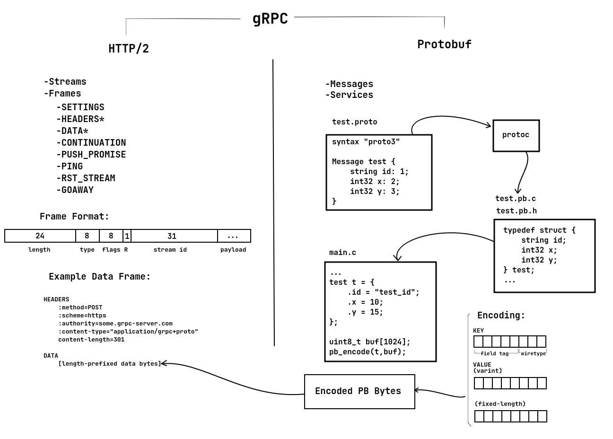

# ESP gRPC

` *This repository is still a work-in-progress and won't function out of the box yet! `

This project is a template or example illustrating how to set up gRPC with the ESP-32 SoC. It is not a library meant to be inserted into an existing project. It is best used as a reference to get started with gRPC on embedded devices.

The following libraries are used:

- [ESP-IDF](https://github.com/espressif/esp-idf) - ESP-32 Development Framework
- [NGHTTP2](https://nghttp2.org/) - HTTP/2 library
- [NanoPB](https://github.com/nanopb/nanopb) - Protobuffer encoding/decoding, code generation

## gRPC Overview

This diagram is an attempt to succinctly encapsulate the protocols and lifecycle of data for gRPC (Protobuffers transmitted over HTTP/2)



**Lifecycle**

1. Protobuffer definition files are created (.proto) based on this syntax (https://developers.google.com/protocol-buffers/docs/overview)
2. The .proto files are compiled to C with protoc compiler
3. The compiled source is included your project where you can fill out structures based on your protobuf messages
4. The structures are encoded into proto buffers
5. The encoded proto buffers are prepended with 5 bytes (compression byte followed by 4-byte data length in big endian)
6. An HTTP/2 HEADERS frame is filled out with necessary pseudoheaders and headers
7. The prepended encoded proto buffers are copied to the payload of an HTTP/2 DATA frame packet
8. The HTTP/2 DATA frame packet is encrypted with TLS
9. The encrypted packet is transmitted to the gRPC server

Note that before transmitting data to the server, a connection needs to be established first by sending a SETTINGS frame. And all DATA frames have at least a HEADERS frame sent immediately before, potentially CONTINUATION frames as well. All of this is handled nicely in the NGHTTP2 library.

## Getting started

1. Clone or download this repository
2. Place your .proto files in the main/proto/ folder
3. Compile your protobuf definition files
```bash
    # linux/mac
    compile_proto.sh

    # windows
    compile_proto.cmd
```
4. Modify the testpb.c/h files to include the generated headers in the generated/ folder
5. Add, modify functions to realize the services provided in your .proto files.
6. Modify the host to point to your gRPC server
7. Compile and run with the ESP-IDF tools

## Usage

```C
#include "grpc.h"
#include "testpb.h"

#define WIFI_SSID "my_ssid"
#define WIFI_PSWD "my_pswd"
#define TIMEZONE  "America/New_York"

void app_main()
{
    // Connect to Wi-Fi
    // ...
    
    // Configure gRPC server connection
    grpc_init_t grpc_cfg = {
        .grpc_core = 1;
        .grpc_stack_size = 8000;
        .grpc_prio = 10;
        .http2_core = 1;
        .http2_stack_size = 22000;
        .http2_prio = 11;
    };

    grpc_init(grpc_cfg);

    grpc_conn_data_t grpc_dat = {
        .ca = grpc_ca;
        .uri = grpc_uri;
    };

    grpc_configure_connection(grpc_dat);

    // Connect to gRPC server
    grpc_connect();

    Message m = {
        .id = "test_id",
        .x = 10,
        .x = 15,
    };

    uint8_t pb[1024] = {0};

    // Encode protobuffer
    int len = testpb_message_create(&m, pb,sizeof(pb));

    // Call test procedure
    grpc_call_proc("/TestService","Create", pb, len);
}

```

## Helpful Resources

| Description       | Link |
|-------------------|------|
| HTTP/2 Spec       | [https://www.rfc-editor.org/rfc/rfc7540](https://www.rfc-editor.org/rfc/rfc7540) |
| Protocol Buffers  | [https://developers.google.com/protocol-buffers/docs/cpptutorial](https://developers.google.com/protocol-buffers/docs/cpptutorial) |
| gRPC over HTTP/2  | [https://github.com/grpc/grpc/blob/master/doc/PROTOCOL-HTTP2.md](https://developers.google.com/protocol-buffers/docs/cpptutorial) |
| gRPC Status Codes | [https://grpc.github.io/grpc/core/md_doc_statuscodes.html](https://grpc.github.io/grpc/core/md_doc_statuscodes.html) |
| NGHTTP2 API       | [https://nghttp2.org/documentation/apiref.html](https://nghttp2.org/documentation/apiref.html) |
